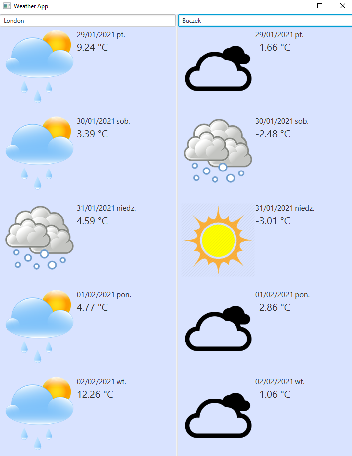

# Weather App

Project to compare weather in two different cities

### **Installation**
> 1) mvn clean install
> 2) mvn exec:java

Notice that Maven is required for upper steps.

### Tests

To run the tests it is enough to run bellow command:

    mvn clean install test

### Open Weather Map API Key

API Key for  https://openweathermap.org should be places in apikey.properties file inside resource folder.
apikey.properties file content should be like below:
    
    OPEN_WEATHER_API_KEY = ACTUAL_API_KEY